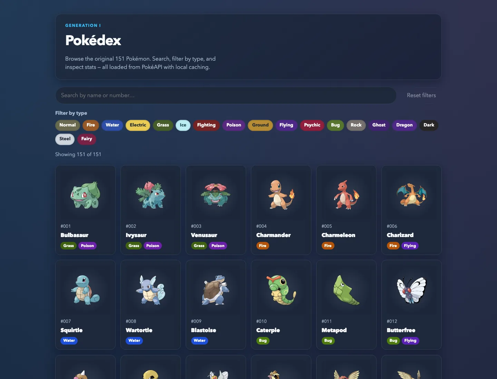
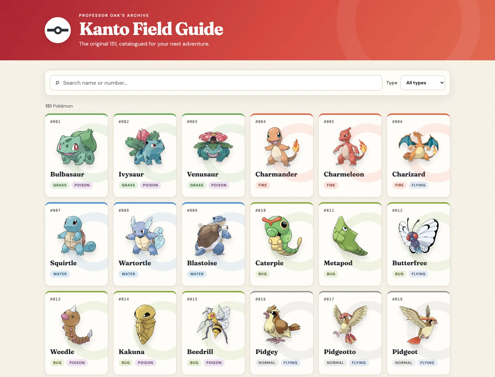
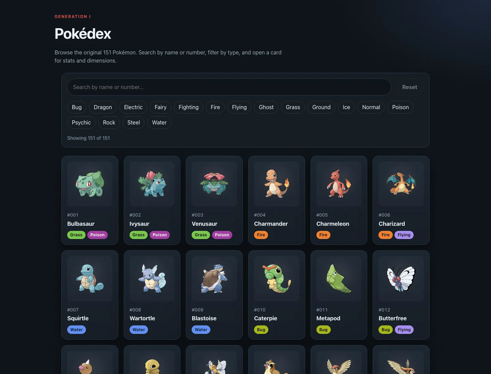
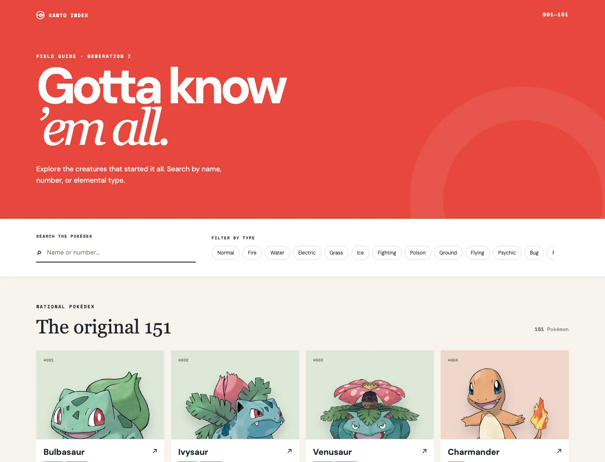

# Routing benchmark comparison

This is a small, sanitized comparison of two controlled dogfood evaluations.
It reports only aggregate outcomes approved for public documentation, not a
claim that one model or routing policy is generally better.

## What was compared

Each comparison used a fixed starting point and the same task-level acceptance
requirements within that comparison. The first was a manual Pokédex web-app
dogfood; the second was a greenfield TypeScript task-queue implementation. The
only intended difference was the model assignment described below. A reported
cost is a catalog estimate from the execution tool, not a billing receipt or a
statement of actual spend.

### Manual Pokédex dogfood

The mixed arm used a mixed Grok/Sol workflow; the baseline used Sol 5.6 Medium
for the parent and all children. Both reached the recorded final pass, although
the baseline needed an initial review fix.

The role assignments were:

```text
Mixed Grok/Sol

Grok 4.5 parent / orchestrator
└── Grok 4.5 implementer
    └── Sol 5.6 High reviewer
        ├── Grok 4.5 repair (when requested)
        └── Grok 4.5 verifier
```

```text
All Sol 5.6 Medium

Sol 5.6 Medium parent / orchestrator
└── Sol 5.6 Medium implementer
    └── Sol 5.6 Medium reviewer
        ├── Sol 5.6 Medium repair (when requested)
        └── Sol 5.6 Medium verifier
```

These flows show model ownership, not one call per line. Reviews and repairs
could repeat; the table below reports the actual aggregate child-call count.

| Observed metric | Mixed Grok/Sol | All Sol 5.6 Medium |
| --- | ---: | ---: |
| Time to completion report | 23m 04s | 12m 36s |
| Child calls | 10 | 4 |
| Review-driven fix passes | 3 | 1 |
| Reported total cost (estimated) | $2.6011 | $2.1827 |
| Final result | PASS | PASS |

For this run, all-Sol was about 10m 28s faster and about $0.4184 lower in
**estimated** total cost. The mixed arm produced broader explicit coverage, but
both outputs need a shared evaluator before their quality can be compared
independently.

#### What the runs produced

These are the two applications from the manual comparison reported above.

| Mixed Grok/Sol | All Sol 5.6 Medium |
| --- | --- |
|  |  |

An earlier exploratory Pi pair produced the applications below. They are shown
for qualitative context only and are not inputs to the performance table above;
that pair had workflow differences that prevented an apples-to-apples claim.

| Exploratory mixed Grok/Sol | Exploratory all Sol 5.6 Medium |
| --- | --- |
|  |  |

### TypeScript task queue

This comparison held the Sol 5.6 Medium parent, reviewer, and verifier fixed;
only the implementer was changed between Grok 4.5 Medium and Sol 5.6 Medium.
Both implementations passed six preregistered behavioral tests after a build.
The mixed arm nevertheless failed the final delivery gate: its public tests
depended on ignored build output, and a clean copy could not run `npm test`.

The controlled role assignments were:

```text
Mixed implementer arm

Sol 5.6 Medium parent / orchestrator
└── Grok 4.5 Medium implementer
    └── Sol 5.6 Medium reviewer
        ├── Grok 4.5 Medium repair (one allowed)
        └── Sol 5.6 Medium verifier
```

```text
All-Sol control arm

Sol 5.6 Medium parent / orchestrator
└── Sol 5.6 Medium implementer
    └── Sol 5.6 Medium reviewer
        ├── Sol 5.6 Medium repair (one allowed)
        └── Sol 5.6 Medium verifier
```

The repair branch was used only when review findings required it. The mixed arm
used its allowed repair; the control arm did not.

| Observed metric | Grok implementer | Sol implementer |
| --- | ---: | ---: |
| Final workflow verdict | FAIL | PASS |
| Child calls | 4/4 | 3/4 |
| Remediation calls | 1 | 0 |
| Time to parent result | 10m 10s | 6m 53s |
| Reported total cost (estimated) | $1.1050 | $0.8933 |
| Preregistered tests after build | 6/6 PASS | 6/6 PASS |
| Clean-copy `npm test` then build | FAIL | PASS |

For this run, all-Sol reached the accepted result 3m 17s sooner, with fewer
child calls and lower **estimated** total cost. The Grok implementer's first
call was cheaper, but that did not translate into an accepted end-to-end
delivery within the allowed remediation budget.

The task-queue output was a TypeScript library without a visual interface, so
there is no application screenshot for either arm.

## Interpretation and limits

The current runs did **not** demonstrate a general mixed-model advantage. The
Pokédex and task-queue outcomes point in different directions for details such
as focused coverage, while the two reported end-to-end comparisons above favor
all-Sol on time, estimated cost, and/or final acceptance. They do show that the
routing recipes executed as requested in these controlled runs.

These are small samples with substantial model and workflow variance. They
cover narrow tasks, use one primary runtime and execution tool, and include
different repair histories. They do not establish statistical significance,
universal quality, live-browser quality, real billing cost, or broad efficiency
savings.

## What would change the conclusion

A stronger claim would require at least five paired tasks with fixed fixtures,
byte-identical parent prompts, a bounded repair budget, and an evaluator-owned
black-box suite applied to every output. Future comparisons should record
provider billing receipts, time to first accepted result, fallback and child-call
counts, and blinded quality findings. Until then, Switchloom should be described
as enabling verified model routing, not as delivering proven cost savings.
