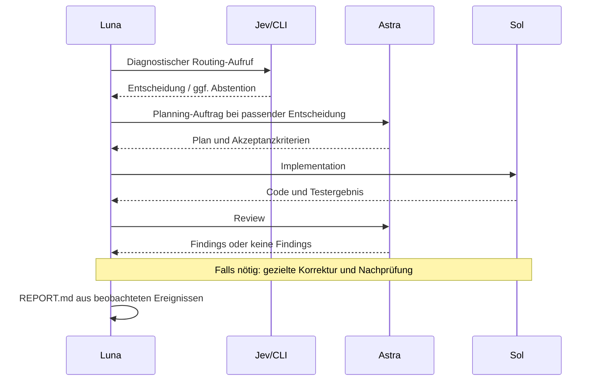

# Desktop-Durchlauf: Anleitung und sichtbarer Ablauf

Dieser Test prüft das Zusammenspiel echter Codex-Tasks. Er ist kein Benchmark
für Kosten oder Qualität. Es wird nichts veröffentlicht. Produktdateien bleiben
unverändert; die Arbeit liegt in `tmp/desktop-smoke-01/` im bestehenden Checkout.

Ersetze `<ABSOLUTER_CHECKOUT_PFAD>` im Testauftrag durch den absoluten Pfad
dieses Checkouts.

## Was du machst

1. Öffne die lokale Switchloom-Website. Klicke **Reset to default**:
   Luna max, Sol medium, Astra high, Jev an. Schalte für diesen Test Browser,
   Computer und Visual design & review aus; 3D ist bereits deaktiviert.
2. Klicke **Copy workflow prompt**.
3. Erstelle in Codex Desktop selbst einen neuen Task im Projekt
   `<ABSOLUTER_CHECKOUT_PFAD>`, direkt im lokalen Checkout.
   Wähle **GPT-5.6 Luna · max**. Verwende nicht den laufenden Entwicklungs-Task.
4. Füge den kopierten Workflow-Prompt ein. Hänge den gesamten Testauftrag aus
   dem nächsten Abschnitt an. Sende beides als **eine Nachricht**.
5. Beobachte die Taskliste. Der Starttask soll als Luna wiederverwendet werden;
   Sol und Astra dürfen als fehlende Tasks angelegt oder passend wiederverwendet
   werden. Keine Worktrees oder Ersatz-Subagents.
6. Öffne bei Bedarf den Empfänger-Task und sein Protokoll. Lass während des
   Tests Modell und Auftrag unverändert, damit die Beobachtung vergleichbar bleibt.
7. Wenn der Ablauf sichtbar festhängt, sichere zuerst die letzten Nachrichten
   und Protokolle. Ein manuelles „weiter“ kann helfen, zählt aber als manueller
   Eingriff und muss im Ergebnis stehen. Es gibt keinen künstlichen Timeout,
   nach dem ein langsamer Task automatisch als defekt gilt.

## Testauftrag zum Anhängen

```text
Führe jetzt einen begrenzten Desktop-Smoke-Test des oben gewählten Workflows aus.
Diese zusätzlichen Regeln gelten für diesen Test.

Projekt: <ABSOLUTER_CHECKOUT_PFAD>, bestehender lokaler Checkout.
Arbeitsordner: tmp/desktop-smoke-01/. Falls er schon existiert, bewahre ihn und
verwende einen neuen nummerierten Ordner. Teile dessen absoluten Pfad allen mit.
Ändere ausschließlich Dateien im gewählten Testordner. Keine Commits, Tags,
Pushes, Deployments, Worktrees, zusätzlichen Manager oder Subagents.

Verwende die CLI aus diesem Checkout, nicht ein möglicherweise älteres
Homebrew-/npm-Binary: <ABSOLUTER_CHECKOUT_PFAD>/target/debug/switchloom.
Lies zuerst <ABSOLUTER_CHECKOUT_PFAD>/skills/switchloom/SKILL.md.
Nutze diesen lokalen Skill auch dann, wenn ein global installierter Skill fehlt
oder älter ist. Verwende für alle handoff-Aufrufe den absoluten CLI-Pfad.
Falls das Binary fehlt, baue es einmal mit cargo build --locked --bin switchloom
im Projektverzeichnis. Keine globale Installation erforderlich.
Für Jev lade die exportierte Umgebung über interaktive zsh. Prüfe nur, ob der
Key gesetzt ist; niemals Key oder Shell-Konfigurationsinhalte ausgeben/loggen.

Aufgabe: Erstelle normalize-label.mjs mit exportierter Funktion normalizeLabel(value)
und normalize-label.test.mjs. Anforderungen: nur Strings akzeptieren, äußeren
Whitespace entfernen, aufeinanderfolgenden Whitespace zu einem Leerzeichen
zusammenfassen und leere Ergebnisse ablehnen. Ungültige Eingaben werfen TypeError.
Nutze nur Node-Bordmittel. Beispiele:
"  Hello\tworld \n" -> "Hello world"; "   " und null -> TypeError.

Ablauf:
- Luna richtet die fehlenden Tasks ein und gibt ihnen vollständige IDs,
  Projekt-/Testordner, Capability-Zuweisungen und diese Protokollregeln mit.
- Führe genau einen diagnostischen Jev-Handoff aus, um die Integration zu prüfen:
  Task = "Define acceptance criteria and the implementation boundary for the
  normalizeLabel utility before any code is written."
  Kontext = die obigen Anforderungen; routing={"mode":"jev"}. Das ist ein Testaufruf, kein Beleg für notwendige
  Klassifikation oder Einsparungen. Nutze die echte konfigurierte Task-Map.
- Bei suggest/clarify oder API-Fehler: protokollieren und den Test als blockiert
  melden. Nicht stillschweigend umleiten und nicht erneut klassifizieren.
- Bei dispatch: den vorbereiteten Auftrag tatsächlich senden und den Turn beenden.
  Bei continue_here: im aktuellen Task fortsetzen, ohne Selbstnachricht.
- Der Planning-Besitzer liefert Scope und Akzeptanzkriterien zurück.
- Luna routet den neuen Implementierungsauftrag mit routing={"mode":"jev"}.
  Sie gibt den relevanten Plan mit und sendet an den gewählten Besitzer. Dieser erstellt die zwei Dateien,
  führt als ebenfalls zugewiesener Validation-Besitzer node --test für die
  Testdatei aus und liefert Änderungen samt Prüfergebnis zurück.
- Luna routet den neuen Review-Auftrag ebenfalls mit routing={"mode":"jev"}. Dieser prüft Code und vorhandene
  Testergebnisse unabhängig und schreibt keine Implementierungsdateien.
- Behebe konkrete Findings innerhalb desselben Scopes; wiederhole nur betroffene
  Checks/Reviews. Wenn alles erfüllt ist, beenden. Fortsetzungen bereits gebundener Aufträge
  verwenden routing={"mode":"assigned","capability":"<gespeicherte Capability>"}.
  Ergebnisnachrichten und Tool-Ausgaben werden nicht erneut klassifiziert.

Beobachtbarkeit ohne zusätzliche Runtime:
- Jeder Task besitzt ausschließlich seine eigene Datei logs/<slot>.md im
  Testordner. Keine gemeinsame Datei mit mehreren Schreibern. Lege keine
  Ersatz-Tasks nur für Logging an.
- Protokolliere mit UTC-Zeit und eindeutiger Auftrags-ID nur wesentliche Ereignisse:
  bootstrap, handoff_prepared, send_accepted, received, work_started,
  validation_finished, reply_accepted, result_received, blocked, done.
- Schreibe die Auftrags-ID in jede Zuordnung und Rücknachricht. Rücknachrichten
  behalten außerdem "Result for:", Ziel-/Sender-Thread-ID und Host.
- Pro Handoff speichert nur der Sender die unveränderte CLI-Ausgabe unter
  logs/<slot>-<auftrags-id>-handoff.json. Bei CLI-Fehlern stattdessen Exitcode und
  bereinigte Fehlermeldung in seinem Markdown-Protokoll.
- handoff_prepared heißt nur: CLI-Ausgabe liegt vor. send_accepted/reply_accepted
  erst nach erfolgreichem Codex-Tool-Ergebnis protokollieren. Bei unklarem
  Tool-Ergebnis den Status als unklar festhalten; keine Zustellung erfinden.
  received/result_received protokolliert der tatsächliche Empfänger.
- Notiere Quelle und Ziel (Slot, echte Task-/Host-ID), Capability, Modell/Effort,
  decision.reason, action sowie Jev-Modell, Confidence und Usage, sofern vorhanden.
  Keine Jev-Usage als gesamte Codex-Nutzung ausgeben. Keine geschätzten Kosten
  oder erfundenen Token-/Quota-Werte. Keine Keys und keine ganzen Chatverläufe.
- Logging erzeugt keine zusätzlichen Nachrichten, Bestätigungen, Polling oder
  Warte-Loops. Die Protokolle sind von Agenten geschrieben und keine unabhängige
  Telemetrie; CLI-Ausgaben und tatsächliche Codex-Tool-Ergebnisse dienen als Belege.
- Luna erstellt nach Abschluss oder einem gemeldeten Blocker REPORT.md im
  Testordner: tatsächliche Task-Map, chronologische Ereignistabelle, Mermaid-
  Sequenzdiagramm des beobachteten Ablaufs, Prüfergebnisse und Einschränkungen.
  Fehlende Ereignisse markieren, nicht ergänzen. Unterscheide geplante von
  beobachteten Schritten und Tool-Annahme von bestätigtem Empfang.
- Gib am Ende Links zu REPORT.md, den drei Protokollen und den Arbeitsdateien aus.
  Melde insbesondere manuelle Eingriffe, verlorene Rücknachrichten, doppelte
  Tasks, fehlende Tools und unerwartete Modellwechsel.
```

## Was du sehen solltest

Das folgende Diagramm ist der **erwartete** Ablauf, noch kein Testresultat.
Der tatsächliche Bericht entsteht erst beim Durchlauf.



Öffne `logs/luna.md`, `logs/sol.md` und `logs/astra.md` in Codex, um den jeweils
letzten protokollierten Schritt zu sehen. Das ist kein automatisch aktualisiertes
Dashboard. Task-Nachrichten und Tool-Aufrufe bleiben die direkte Beobachtung.

## Wann der Test bestanden ist

- Tatsächliche IDs, richtige Modelle und derselbe lokale Checkout sind belegt.
- Der diagnostische Jev-Aufruf ist dokumentiert; kein Send bei Abstention/Fehler.
- Auftrag und Rücknachricht lassen sich pro Auftrags-ID zuordnen.
- Rücknachrichten setzen Arbeit fort, ohne manuelles „weiter“ oder Ergebnis-Echos.
- Nur Sol schreibt die Implementierung; nur der jeweilige Task schreibt sein Log.
- Tests und unabhängiges Review sind abgeschlossen; Findings sind abgearbeitet.
- Bericht unterscheidet Durchführung, Testbelege und nicht beobachtete Punkte.

Ein einzelner erfolgreicher Durchlauf beweist weder Robustheit aller Abläufe
noch Kostenersparnis. Wiederverwendung, Zwei-Task-Modus und Fehlerfälle werden
anschließend separat geprüft. Für Vanilla einen neuen Testordner und einen
neuen Starttask verwenden, Jev im Board ausschalten und den diagnostischen
Aufruf durch explizites Planning mit jev=false ersetzen. Alle anderen
Anforderungen bleiben gleich; der vorgeschaltete Jev-Test darf nicht in einen
späteren fairen Kostenvergleich eingerechnet werden.
